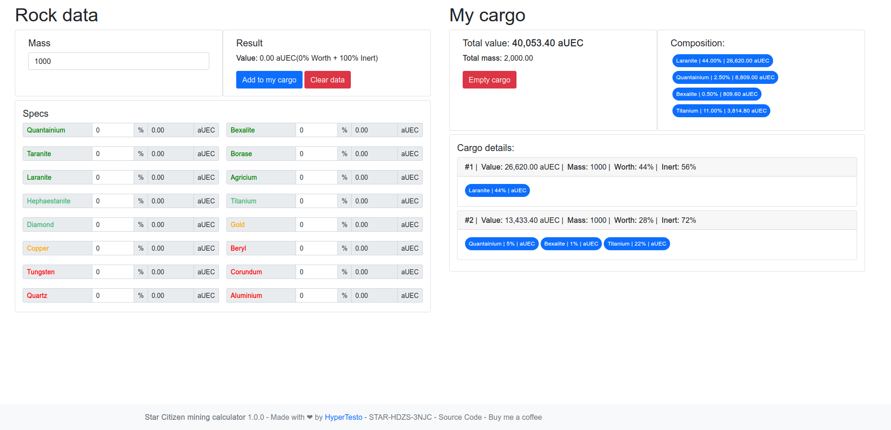

# Star Citizen Mining calculator
[](LICENSE.md)
[](https://app.netlify.com/sites/practical-kilby-285485/deploys)
[](#)
[](https://www.buymeacoffee.com/hypertesto)



_An attempt to build a Star Citizen Calculator and learn some Vue.js._

A simple Star Citizen mining calculator for MOLE and Prospector users.
You can find it on: [sc-mining.app](https://sc-mining-calc.github.io)

## Install
You can use this project locally on your PC or on your favorite host. All you
need to do is clone the repo and open ```index.html``` with your favorite browser:

```bash
$ git clone https://gitlab.com/HyperTesto/sc-mining.app
```

## Support
Reach out to me at one of the following places:

* on [issues page](https://github.com/HyperTesto/sc-mining-calc/issues) in the project repo

## Donations
If you find this tool useful and like to support its  development, then consider a donation.

* VRSC: `RPv2eD5d1327DYfLb4fjZASZtibjuXf6mT`
* BMC: https://www.buymeacoffee.com/hypertesto


## License
[MIT](LICENSE.md)
